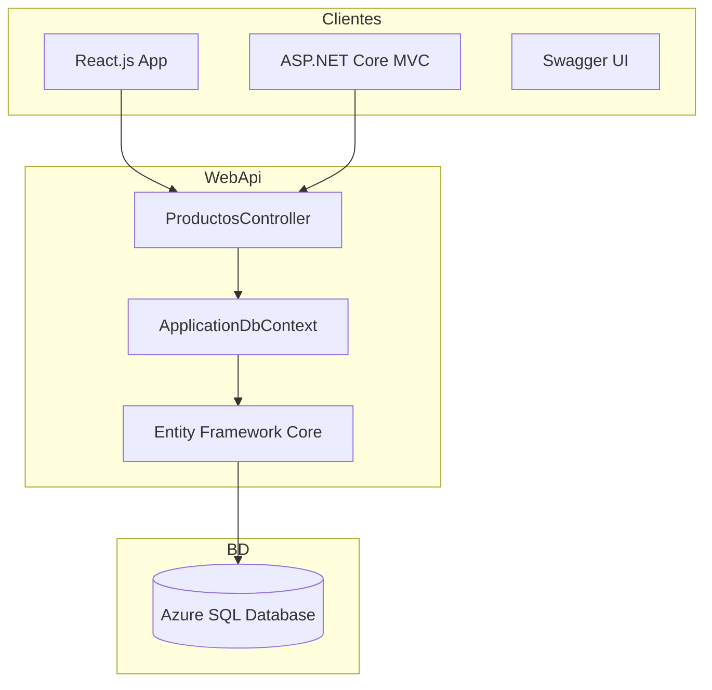

# Resumen de Creación: NikiShop.Ecommerce.WebApi

Este documento detalla los pasos seguidos para la creación y configuración de la Web API del proyecto NikiShop, utilizando .NET 5.0 y Entity Framework Core.

## 1. Creación del Entorno
- **Solución:** Se creó `NikiShop.slnx` para la gestión de múltiples proyectos.
- **Proyecto API:** Se generó mediante el comando:
  ```bash
  dotnet new webapi -n NikiShop.Ecommerce.WebApi -f net5.0
  ```

## 2. Configuración de Acceso a Datos (EF Core)
- **NuGet:** Instalación de `Microsoft.EntityFrameworkCore.SqlServer` y `Tools` (v5.0.17).
- **Cadena de Conexión:** Configurada en `appsettings.json` para conectar con Azure SQL (`nikishop.database.windows.net`).
- **DbContext:** Creación de `ApplicationDbContext.cs` para la orquestación de datos.

## 3. Modelado (Scaffolding)
- **Comando:** `dotnet ef dbcontext scaffold` para generar el modelo desde la base de datos.
- **Mapeo:** Uso de Data Annotations (`[Key]`, `[Table]`, `[Column]`) para sincronizar nombres de propiedades en C# con columnas `snake_case` en SQL.

## 4. Implementación del Controlador
- **ProductosController:** Endpoints asíncronos para lectura de datos.
- **Paginación Dinámica:** Implementación de `page` y `pageSize` mediante `Skip()` y `Take()` en LINQ.

## 5. Configuración del Pipeline (Startup.cs)
- **Servicios:** Registro de `AddDbContext` y configuración de políticas **CORS** (AllowAll).
- **Middleware:** Uso de `app.UseCors()` y activación de logging de queries SQL en `appsettings.Development.json`.

---

## Arquitectura de la Solución



---

## ¿Qué es Entity Framework Core?
Es un **ORM (Object-Relational Mapper)** que permite interactuar con bases de datos usando objetos de .NET. Facilita el desarrollo al evitar escribir SQL manual, proporcionando tipado fuerte y validación en tiempo de compilación mediante LINQ.
